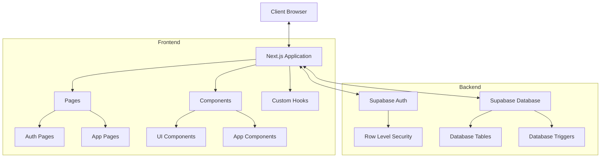
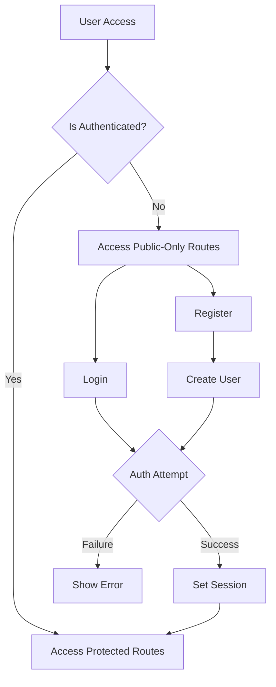
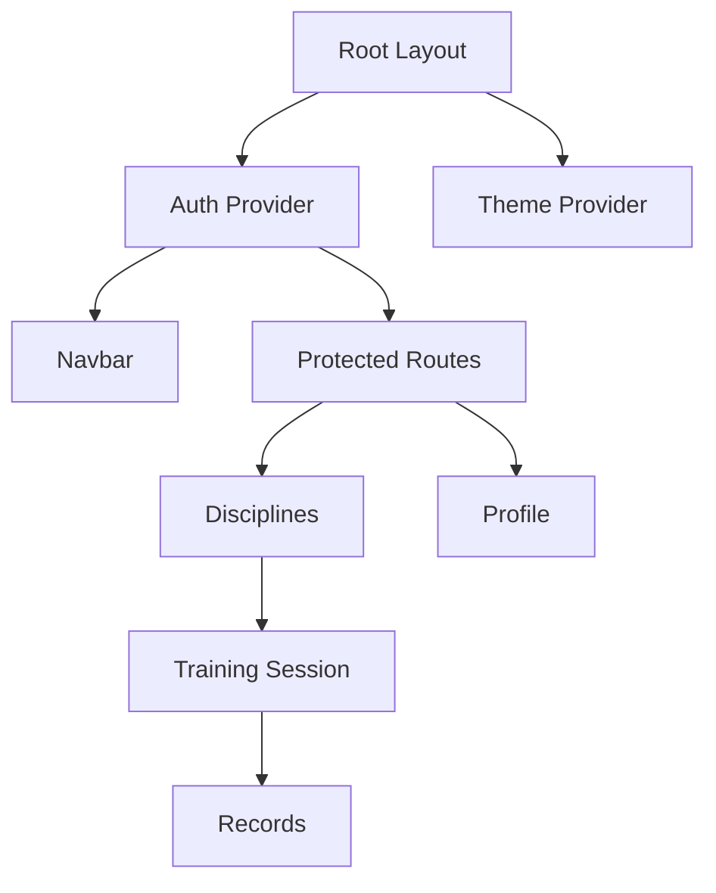

# Test Memory - System Patterns

## System Architecture

The Test Memory application follows a modern web application architecture with Next.js App Router and Supabase as the backend service.

## Design Patterns

### 1. Component Architecture

- **Atomic Design Principles**: UI components organized from atomic elements to complex organisms
- **Component Composition**: Components built as composable units
- **Render Props / Higher-Order Components**: Used for shared functionality

### 2. State Management

- **React Context**: Used for global state (authentication)
- **Local Component State**: Used for component-specific state
- **Server Components**: Leveraging Next.js 14 App Router for server-side rendering where appropriate
- **Zustand Store**: For more complex state management needs

### 3. Authentication Flow

### 4. Data Management

- **Database Tables**: Normalized data structure with clear relationships
- **Row Level Security (RLS)**: Ensuring users only access allowed data
- **Realtime Subscriptions**: For live updates (future implementation)

### 5. Form Handling

- **React Hook Form**: For form state management
- **Zod**: For schema validation
- **Controlled Inputs**: For form fields

## Key Technical Decisions

1. **Next.js App Router**: Using the latest Next.js features for routing and server components
2. **Supabase**: Chosen for combined auth and database functionality
3. **TypeScript**: For type safety and better developer experience
4. **Tailwind CSS + shadcn/ui**: For consistent, maintainable styling
5. **Server Actions**: For server-side mutations when needed

## Component Relationships

## Error Handling Strategy

1. **Form Validation**: Client-side validation with graceful error messages
2. **API Error Handling**: Consistent error format from Supabase operations
3. **UI Error States**: Clear visual indicators for error states
4. **Error Boundaries**: For component-level error containment
